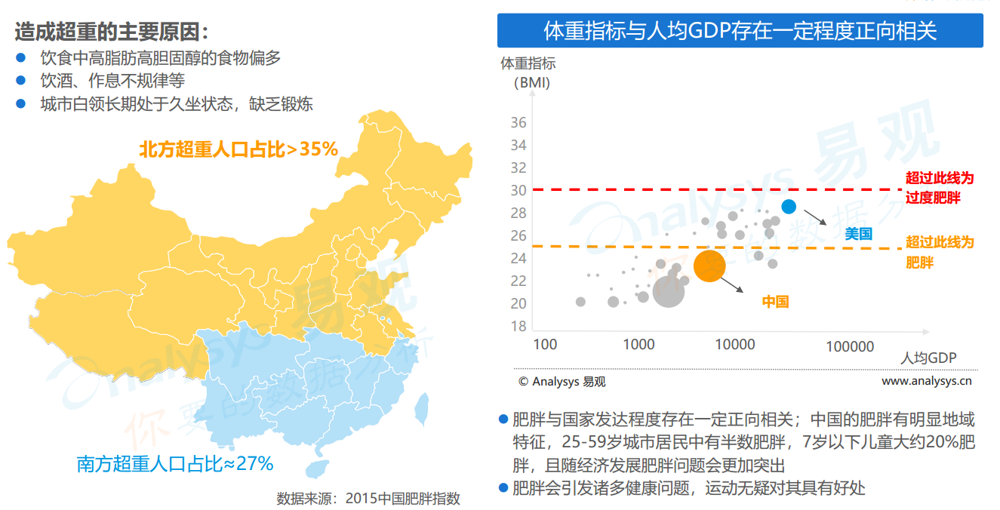
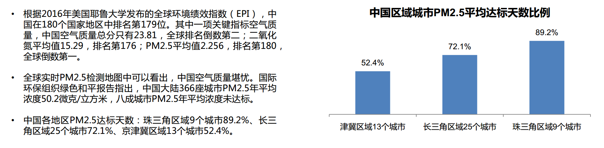
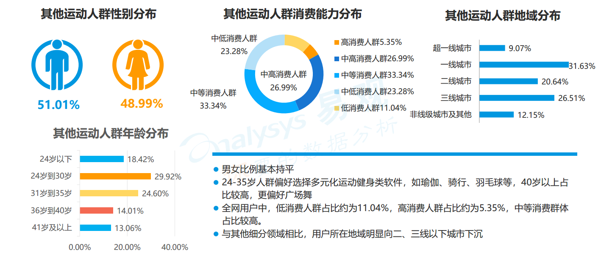
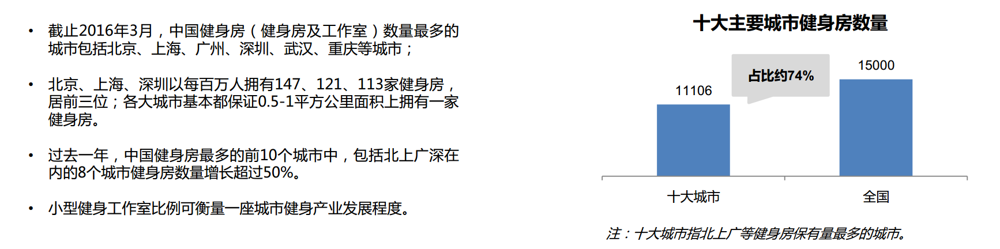

#健身行业分析报告

#### by 叶剑武 

### 前言：     

随着我国人民健身意识的进一步提升和健身房商业模式的进一步成熟，我国健身 产业发展迅速。 2016年体育总局与国务院分别颁布《体育发展十三五规划》 、 《全民 健身计划（2016-2020） 》 ，提出到2020年，每周参加1次及以上体育锻炼的人数达7亿， 经常参加体育锻炼的人数达4.35亿，体育消费总规模达1.5万亿元等，目标是把全民健身打造成国家名片。 

人们参加体育锻炼的主要目的是：提高身体素质（35.6%）、，消 遣娱乐（17.4%）和增加体力活动（16.0%）。其它目的依次是：防病 治病，减轻压力放松，减肥，健美，提高运动技巧，社交等。其中， 出于健美目的的只有2.0%，出于减肥目的有6.3%   

### 健身产业主要政策汇总：

 随着我国经济社会的快速发展，越来越多的人注重运动健身。同时我国政府高度重视体育活动在增强 体质、提高健康水平中的重要作用。

- 1995年，国务院颁布实施《全民健身计划纲要》 ；  
-  2007年，国务院下发《关于加强青少年体育增强青少年体质的意见》 ；  
-  2014年，国务院下发《关于加快发展体育产业促进体育消费的若干意见》 ；  
- 2016年6月，为促进健身产业发展、增强全民身体素质，国务院印发《全民健身计划（2016—2020 年） 》 对发展群众体育活动、倡导全民健身新时尚、推进健康中国建设做出了明确部署；   
- 2017年8月11日，针对中国居民参加体育健身活动状况实际，国家体育总局发布了《全民健身指南》  

## 一. 行业介绍  

    

   健身产业链上游主要为健身IP、 健身器材研发、 健身课程内容研収发、 健身教练培训；中游主要为俱乐部、 工作室、 线上社区平台等，下游是用户及围绕用户的服 务。 **中国健身行业目前市场规模预计约1000亿，主要的商业模式包括健身器材（400亿）、 健身房运营（300亿）、 健身鞋服销售（240亿）。**    

**健身行业上游盈利模式多样潜力大。** 健身课程内容研发领域是IP之争，研发一套自己的系统，具有各种变现方式：Crossfit全面强健（全球加盟模式，估值40亿美 元）、 瑜伽（Lululemon瑜伽用品，市值90亿美元）、 Les Mills莱美团课（授权加盟模式，课程季度迭代）。 中国目前健身教练10几万，假训人均培训花费1万元，市场空间10亿。 健身IP拥有丰富变现模式，代表案例：暴走的萝莉（淘宝店铺粉丝185万，年流水超过2亿，位列2016年淘宝运动服销量掋行榜第五名，仅次于安踏，高于UA等），郑多燕有氧健身操（健身光盘售出超过8700万张、 郑多燕IP为核心的全生态运营）。

健身俱乐部行业市场结构是多元的，源于用户成长路径和需求是多元的。 供给局面原来主要以大型健身房和特定项目健身工作室为主，满足的主要是中高端或偏中重度健身人群的需求；近两年来，以Keep和小米为代表的互联网健身软硬件产品崛起，降低门槛，带动一批健身小白用户入门，Keep注册用户突破6000万， 月活2200万，小米2016年出货量1570万台，仅次于fitbit。 以Keep、 乐刻健身、 光猪健身、 超级猩猩为代表的自助健身房，一方面缓解了体育场馆不足的问题， 另一方面，为入门级小白及腰部人群提供了对应的健身产品，带来了增量市场。 从互联网工具健身、 自助健身房、 大型健身房、 精品工作室的用户进阶路径，产 品之间不是互相取代关系，而是共同发展，满足不同层次的用户需求。 未来大型健身集团存在整合和拓展空间，多品牌发展，把握用户全生命周期，陈低营销成本。    

###1. 中国健身市场发展历史与驱动因素  

####1.1、政策端：医保卡健身新政，打开健身人群   

#### 1.2、需求端：肥胖人口激增，各年龄段锻炼需求提升  

  

## 

####1.3、需求端：城市空气污染严重，室内健身偏好提升    

#### 1.4、技术端：健身相关软硬件发展，健身成为引爆社交媒体的主题    

### 2. 中国健身产业发展特点：   

就我国健身产业供给端来看，健身市场竞争激烈，大量竞争者导致国内商业健身市场品牌分散，行业标准及门槛较低。需求端来看，国内健身观念与习惯仍在建立过程中，国民运动和健身 意识仍需加强。不过， 近两年来随着国家大力支持鼓励全民健身、积极参加锻炼以及国外健身风潮刮至国内带动成年人走进健身房，使得我国居民健身意识不断提高，逐渐发展为习惯。  

## 二. 行业生命周期分析 

#### 1. 市场现状

##### 1.1. 健身俱乐部数量

健身俱乐部数量是健身行业发展状 况的重要指标，我国健身俱乐部数量自 出现以来一直保持较高的增长，从 2010 年 3245 家增至 2017年的5000余家。虽然在 2011-2013 年间，由于健身市场竞 争加剧导致行业出现关门潮，健身俱乐部数量增长速度放缓甚至为负。但是， 随着近年来健身人口的快速增长和专业化指导需求加剧，新一轮的健身风潮带动行业出现复苏迹象，健身俱乐部数量也随之迅速增长。  

   ##### 1.2. 健身俱乐部会员数    

我国健身会员数量在 2011-2013年间增长放缓，但近两年随着新一轮健身潮流的兴起以及健身俱乐部的扩张，会 员人数又出现了显著的增长。 2017年健身会员数量增至近900万 人，同比增长14.97%。会员平均年龄在 在30.7岁左右，健身会员的平均年龄基本没有发化，但健身会员的年龄结极出现较大的发化： 25-29岁， 36-40岁年龄 段的用户有较大增长，健身会员的整体年龄分布更加分散。 

  

##### 1.3. 中国健身产业规模  

数据显示： 2012-2017年我国经常参加体育锻炼的人数不断上升， 2017年全国经常参加体育锻炼的人数达到5.5亿人，占全国人口的比重达41.3%左右。北京每周至少锻炼一次的人口比例最高，为50%。国内体育活动活跃人口 规模居于前列的其他省市包括重庆、辽宁省、上海和天津。 庞大的健身人口为健身行业带来巨大的需求。 2017年我国健身产业总产值约为1500亿元，近六年年均复合增 长率为7.7% 。

##### 1.4. 健身行业人口渗透率  

全球健身俱乐部行业：市场规模近6000亿，会员1.45亿人 ，美国市场超1500亿，人口渗透率超17%  ，美国、 英国、 德国为前三大市场，中国位列第12 。 

##### 1.5. 各地区锻炼人数比例  

虽然各地区间体育活动比率不尽相同，但是人口调查结果显示全国总体参与体育锻炼的中国人越来越多。最新数据显示平均有略超过三分之一、即34%的中国人经常性地参与体育锻炼——较七年前28.2%的数据有了大幅提高。考虑到中国经济发展所催生的诸多自下而上因素的作用以及政府政策鼓励所产生的自上而下的效应，未来这个百分比还会有进一步增长 。

##### 1.6. 健身行业潜力区  

- 国内据估有8,000万至1亿老年人（几乎清一色是妇女）都热衷于“广场舞”这种舞蹈健身操运动。  广场舞这种运动形式在国内老年人中蔚然成风，尽管也会招致非议，但其中蕴藏的巨大商机也引来了国内企业和投资者的竞相追捧  
- 推动中国社会运动健身热发展的最大潜在动力可能来自于传统武术和强身健体方法。传统武术和健身法（后者又称“养生术”）风靡今日之中国，不过这些文化色彩独特的体育健身手段也已与国际潮流脱节。 释放国内体育健身市场潜力的一个重大机遇在于实现中国传统养生健体理念与现代消费需求的对接 。  

- 运动健身群体关注医疗健康，从运动到健康，更多场景可以开发。目前市面上的运动健身产品， 很少将健康管 理作为卖点。 而从数据中观察， 运动健身应用使用群体在医疗健康领域的TGI>3， 即运 动健身应用使用人群在医疗健康领域的付费意愿更高。如何有效搜集其他人体健康有关的数据， 与 运动数据一道指导于智能化健康管理方案中， 会是未来运动健身应用的一个发展方向。 从运动上升到健康， 挖掘更多消费场景， 是未来领域内应用变现的又一突破口。   

     

##### 1.7. 产业问题及解决办法    

##### 1.7.1. 运动健身应用需要打破同质化现状，发挥资源优势实现品牌化发展  

##### 1.7.2. 围绕健康、新技术、多场景发展的运动健身应用的可能发展    

##### 1.8. 健身产业规模预测  

2012-2017年我国健身行业产值年均复合增长率为6.7%， 2017年我国健身产业总产值约为1500亿元。 在国家政策大力支持引导下，预计到2020年我国健身产业总产值能实现1850亿元， 到2022年健身产业规模将进一步超过2000亿元 。

目前国内年个人消费总额已突破4万亿美元。到2030年时这一数字将增长超过三倍。中国人口呈现老龄化趋势，但其富裕程度无疑在提高。与受薪阶层相 比，退休人群在消费方面可能更为保守，但这并不是说他们就不会消费。他们当中还会产生与年龄相关的保健养生需求，这就为创新型体育健身机构提供了新的机遇。  

#### 

#### 2. 用户画像  

 **2.1. 健身人群： 30岁以下女性更偏好健身类应用**    

##### 2.2. 跑步人群： 24-30岁男性更偏好跑步类应用    

##### 2.3. 健走人群：与跑步人群相比女性比例更高，高消费人群较少    

##### 2.4. 其他运动人群：二、三线城市及以下更倾向于选择广场舞    

##### 2.5. 年轻女性偏好健身类应用，男性在跑步、健走市场更活跃  

- 女性对健身类应用偏好更强烈， 男性则偏好跑步、 健走一类的户外项目、竞技类运动的兴趣更高。 
- 在年龄分布上， 30岁以下更加偏好健身一类较为剧烈的活动方式，且智慧健身房一类的新健身模式主要吸引的也是年轻人的参与。以课程为主要产品、兼顾 电商的在线健身产品吸引到了更多有精力学习的年轻群体。
- 跑步、 健走、广场舞在吸引到的40岁以上群体的数量占比上基本相当。  

##### 2.6. 健走、其他运动向二、三线城市下沉，用户消费能力稍弱    

- 从用户消费能力来看， 健身、 跑步吸引到了更多的中高、 高消费群体， 而健走和其他运动的用户消费能力相对较弱。 地域分布上与之有相似的特征， 虽然四个领域均是超一线和一线合计占比更高，但是健走、广场舞用户二线及二线以下的占比更高， 尤其是广场舞产品向二、 三线城市下沉明显。 
- 健身类应用中的智慧健身房主要建立在超一线、 一线城市， 一定程度上拉高了健身类应用在该级别城市上的渗透。  

#### 3. 产品的种类   

##### 2.1.健身俱乐部：五大主要类别  

##### 3.1.1. 区域发展：

- ##### 一线向准一线及二线城市蔓延    

- ##### 一线/准一线城市健身房数量增速超50%  

     

- ##### 一线/准一线城市集中全国70%以上健身房  

   

##### 3.2. 线上产品是角度切入，整合线下资源布局运动健康领域  

##### 3.2.1. 线上产品从不同运动项目切入面对不同人群，多角度寻求变现  

##### 3.2.2. 在线运动健身,运动数据为产品核心  

在线运动健身与智能硬件相配合完成运动中有效数据的收集、 线上提供教学培训等成为在线运动健身产品的主要模式。

  

##### 3.2.3. 健走计步、跑步、健身类应用占据最多的线上运动健身流量    

- 线上运动健康领域活跃用户在全网中的渗透率为6.98%，数据分析认为在全网用户不会产生大幅增量的今天，在线运动健身领域流量还会有所增长但不会太多，厂商间面临存量竞争的局面。

- 从细分市场来看，以健走计步、跑步、健身三个角度切入的应用瓜分了市场上绝大多数流量。以其他运动类型切入市场的包括：广场舞、骑行、瑜伽、钓鱼、 羽毛球等。

-  头部厂商对流量的收割情况可以侧面看出该细分领域的竞争情况。跑步类应用竞争最为激烈，在线运动健身领域月活Top10中有7家属于跑步类应用，因而流量资源的把控最为分散，健走领域聚集了大量的计步类产品，部分存在预装优势。  

  

##### 

#### 4.竞争者数量及进出壁垒   

##### 4.1. 健身一家占优，跑步竞争仍在继续

- **领先者： 领先者在市场中具有极大的优势：用户积累大， 具有强大的资金 支持和运营能力， 已经形成品牌， 具有多角度变现的能力。 KEEP 的月活占到健身类应用的88%。** 
- **创新者： 创新者在用户量的积累上与领先者存在差距， 但是其商业模式与 产品往往具有创新， 现阶段率先开展线上跑赛事的悦跑圈和用专 业健身课程赋能B端的火辣健身处于该象限。** 
- **务实者： 务实者往往由于先发优势或差异化的人群定位占领了先机，积累了用户， 运营风格较为稳健，创新能力稍弱。咕咚重新打造只能 硬件创立运动品牌有望重归领导者象限，糖豆广场舞则依靠差异化人群迅速出现。**
-  **补缺者： 补缺者阵营中厂商用户数量不突出， 产品功能方面创新属性较少。 咕咚善跑具备持续运营能力， 与马拉松官方合作，与高校合作，再加上对赛事的运营， 有望的2018年进入创新者阵营。**  

**横轴——创新能力包括产业链、 商业模式、 产品等创新能力**

**纵轴——执行能力包括收入规模、 用户规模等指标**  

##### 4.2. 核心产品剖析  

**4.2.1. Keep: 推出智能硬件和线下运动空间，构建科技运动生态**    

 **4.2.2. 咪咕善跑：泛娱乐资源、流量加持，推广全民运动**   

 

##### 4.2.3. 悦动圈：红包引流，聚焦健走，坚定吸引初级运动群体    

##### 4.2.4. 糖豆：改名后降低“广场舞”属性，重点发展短视频                                                                                                                                                                                                                                                                                                                                                                                                                                                                                                                                                                                                                                                                                                                                                                                                                                                                                                                                                                                                                                                                                                                                                                                                                                                                                                                                                                                                                                                                                                                                                                                                                                                                                                                                                                                                                                                                                                                                                                                                                                                                                                                                                                                                                                                                                                                                                                                                                                                                                                                                                                                                                                                                                                                                                                                                                                                                                                                                                                                                                                                                                                                                                                                                                                                                                                                                                                                                                                                                                                                                                                                                                                                                                                                                                                                                                                                                                                                                                                                                                                                                                                                                                                                                                                                                                                                                                                                                                                                                                                                                                                                                                                                                                                                                                                                                                                                                                                                                                                                                                                                                                                                                                                                                                                                                                                                                                                                                                                                                                                                                                                                                                                                                                                                                                                                                                                                                                                                                                                                                                                                                                                                                                                                                                                                                                                                                                                                                                                                                                                                                                                                                                                                                                                                                                                                                                                                                                                                                                                                                                                                                                                                                                                                                                                                                                                                                                                                                                                                                                                                                                                                                                                                                                                                                                                                                                                                                                                                                                                                                                                                                                                                                                                                                                                                                                                                                                                                                                                                                                                                                                                                                                                                                                                                                                                                                                                                                                                                                                                                                                                                                                                                                                                                                                                                                                                                                                                                                                                                                                                                                                                                                                                                                                                                                                                                                                                                                                                                                                                                                                                                                                                                                                                                                                                                                                                                                                                                                                                                                                                                                                                                                                                                                                                                                                                                                                                                                                                                                                                                                                                                                                                                                                                                                                                                                                                                                                                                                                                                                                                                                                                                                                                                                                                                                                                                                                                                                                                                                                                                                                                                                                                                                                                                                                                                                                                                                                                                                                                                                                                                                                                                                                                                                                                                                                                                                                                                                                                                                                                                                                                                                                                                                                                                                                                                                                                                                                                                                                                                                                                                                                                                                                                                                                                                                                                                                                                                                                                                                                                                                                                                                                                                                                                                                                                                                                                                                                                                                                                                                                                                                                                                                                                                                                                                                                                                                                                                                                                                                                                                                                                                                                                                                                                                                                                                                                                                                                                                                                                                                                                                                                                                                                                                                                                                                                                                                                                                                                                                                                                                                                                                                                                                                                                                                                                                                                                                                                                                                                                                                                                                                                                                                                                                                                                                                                                                                                                                                                                                                                                                                                                                                                                                                                                                                                                                                                                                                                                                                                                                                                                                                                                                                                                                                                                                                                                                                                                                                                                                                                                                                                                                                                                                                                                                                                                                                                                                                                                                                                                                                                                                                                                                                                                                                                                                                                                                                                                                                                                                                                                                                                                                                                                                                                                                                                                                                                                                                                                                                                                                                                                                                                                                                                                                                                                                                                                                                                                                                                                                                                                                                                                                                                                                                                                                                                                                                                                                                                                                                                                                                                                                                                                                                                                                                                                                                                                                                                                                                                                                                                                                                                                                                                                                                                                                                                                                                                                                                                                                                                                                                                                                                                                                                                                                                                                                                                                                                                                                                                                                                                                                                                                                                                                                                                                         

5. #### 中国移动健身应用运营模式分析   

