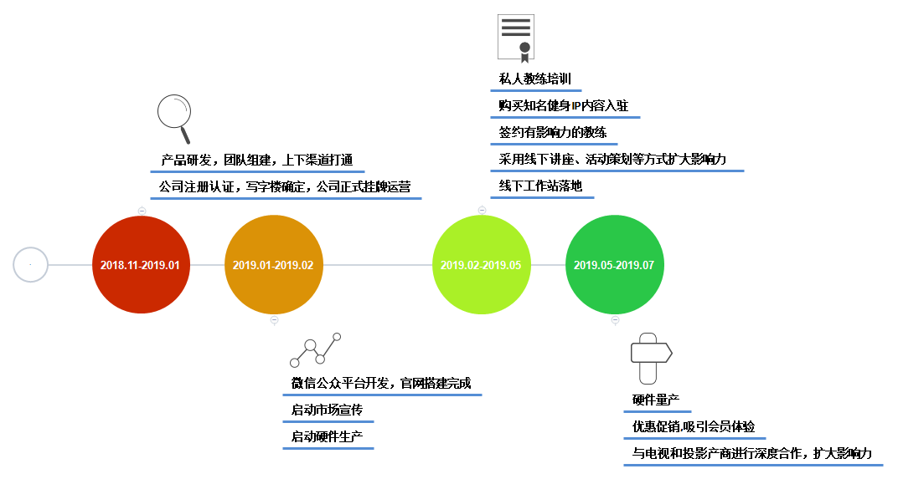

# 商业计划书(大纲版)    

## 

## 项目名称：  

**布拿拿健身**（bunana.com）

**定位；都市中高端收入职场女性白领个性化家庭健身服务提供商**

**slogon：让你的健身更科学，更专业，更方便**   

**愿景：为用户提供一站式健身解决方案，成为全球最大的 “互联网+“ 家庭健身品牌**

**使命：响应国家政策，让都市职业白领女性更美更健康**  

## 

## 市场背景：  

#### **运 动 健 身 创 业 的 黄 金 十 年**   

#### **国家政策利好**   

1. **2014年9月2日国务院常务委员会部署加快发展体育产业、促进体育消费**
   **推动大众健身。**

2. **2014年10月20日《国务院关于加快发展体育产业促进体育消费的意见》，意见明确提出“大力吸引社会投资”，鼓励社会资本进入体育产业领域。**
3. **国务院46号文中将全民健身上升为国家战略。**
4. **中央经济工作会议将体育健身上升为国家战略。**   
5. **2016年6月，为促进健身产业发展、增强全民身体素质，国务院印发《全民健身计划（2016—2020 年） 》 对发展群众体育活动、倡导全民健身新时尚、推进健康中国建设做出了明确部署；**    
6. **2017年8月11日，针对中国居民参加体育健身活动状况实际，国家体育总局发布了《全民健身指南》**  

#### **市场前景广阔**   

1. **到2025年，经常参加体育锻炼的人口数将达5亿人口以上（目前为3.64亿）。我国体育产业总规模超过5万元（目前约万亿）。**
2. **2015年中国健身卡加教练收入为300亿，未来将达到5倍的增长量。体育运动用品的规模为2000亿左右。**
3. **参考发达国家，美国有3亿人口，67%都在健身，市场规模1600亿左右。**
4. **职场白领女性人群普遍注重减脂、减压，追求时尚，追求漂亮，因此他们对健身有着强烈的需求。**  
5. **运动是最好的良药：我国中国高血压人口有1.6-1.7亿人，高血脂的有1亿多人，糖尿病患者达到9240万人，超重或者肥胖症7000万-2亿人，血脂异常的1.6亿人，脂肪肝患者约1.2亿人。**

## 

## 产品服务：       

**当下健身市场，中高端收入女性白领有着强烈的减脂减压，瘦身塑性的需求，然而目前市场上的健身解决方案对于职场女性来说依然存在诸多痛点（健身距离远，效果差，难坚持，缺乏科学的个性化运动健身方案）。为此，”布拿拿健身“ 横空出世，”布拿拿健身“是 以家庭为健身应用场景，通过双向在线视频健身直播的方式为用户提供个性化的互动健身教学服务。用户可以根据他们的时间表自由地安排健身时间，让缺少时间的职场女性足不出户就能享受到优于健身房的体验。**     

**”布拿拿健身“ 类似与国外的 ”Wello“的模式，这个模式在国外已经得到了很好的验证，但是国内却是首例。我们利用在线一对多的健身互动直播方式作为载体，将线下最受女性白领欢迎的精品团课线上化，采取零售化的模式销售给用户， 在很大程度上减低了用户的决策门槛。** 

## 

## 解决方案：  

### To 用户 — 解放运动场景，为用户量身定制一站式健身解决方案  

1. #### 解放运动场景，合理利用家庭客厅       

- 用户只需将我们自主研发的硬件和客厅的电视或者投影仪连接后，利用手机登陆账号密码就可以进入到自己购买的健身课程进行大屏互动学习，由教练指导锻炼。将场地从健身房扩大到海量的2*2平米客厅空地，大大缩减了健身场地成本；

2. #### 研发特色课程，解决用户需求 

- 极速减脂、完美塑形、产后修复、瑜伽...   

3. #### 建立健康档案，量身定制方案   

- 在公司、社区设置线下工作站，为用户进行体测，建立健康档案。按照饮食+运动的方式为每一位用户量身定制健身方案;    

4. #### 搭配硬件，让用户的健身数据可视化    

- 健身过程中，学员的卡路里消耗，心率变化等运动健身数据会通过我们自研的手环进行收集，用户在健身过程中可以通过屏幕实时观测到自己的健身数据。课程结束后，系统会推送给用户这节课的运动消耗情况的图片，用户可以一键分享到朋友圈，满足和朋友的即时互动。
- 健身过程中，学员的健身数据如果没有达到课程要求的话，教练会提醒学员增加强度以达到健身课程要求。

5. #### 颠覆传统在线健身模式，让用户的健身不在孤独

- 学员除了可以与教练进行互动外，小组参加者也能够实时看到同组其他成员的锻炼情况并相互监督鼓励。相比传统的在线社交，这种实时的社交在大大增加了健身的乐趣的同时，也提高了用户对与平台的粘性。  

6. #### 定期举办沙龙活动     

- 把线下工作站建成一个女性之家，通过定期举办沙龙活动，增加她们在社交上面的需求。让用户培养出健康的生活习惯和生活方式。

7. #### 教练每日督促，进行健身指导  

- 教练通过线上双向的互动视频教学、线下微信答疑的方式进行指导，督促用户进行健身的同时，保证了用户的科学健身；        

### To 教练 — 减少教练闲置时间，提供培训、工具，提高教练服务质量与效率  

1. #### 打破场地限制，教练自由流动

- 用户线上预约，教练线上、线下服务，提升闲置时间利用率； 

2. #### 推出多样课程，提高教练单位时间产能与收入  

- 一对多精品小团课   
- 一对一私教课  
- 企业小团体课   

3. #### 自建培训体系，打造优质服务        

- 专业技能培训     
- 课程教学培训  
- 服务管理培训  

4. #### 为教练提供管理软件，提高教练效率

- 为教练提供管理会员的SaaS健身系统，提高教练的效率

## 

## 盈利模式：  

#### 前期：

- **课程内容付费提成**    
- **教练高端培训收费**  
- **线下工作站的运动用品（装备，营养补剂等）售卖**  

#### 后期：

- **后期线下工作站可以为用户提供一整套的医疗保健美容服务，进行服务收费**   
- **后期扩张采用教练加盟的模式，盈利还可以来源于加盟费**   

## 

## 用户市场：  

**目标用户初期定位在20~40岁的职场女性白领、时尚女性用户、产后妈妈群体，**

~~以后再逐渐扩大到普通白领、少儿、老年群体，最终覆盖全国2亿用户~~。    

**初期用户特点如下：**

-  **接受新事物能力强；**
-  **个人年收入在10万以上;**     
-  **有强烈的减压、减肥、改善体形、产后塑形、运动社交需求；**   

## 

## 优势壁垒：   

- **这种通过在线直播将个人与私人教练联系起来让用户接受私人健身指导的健身模式，国外的 ”Wello“ 已经验证是可以大获成功的，然而国内却是首例，为此，对于我们来说在这种模式下摆在我们面前的依然还是一片蓝海等着我们去开拓。**  
- **对于一些肥胖的女性，由于自卑的原因，她们想健身减肥，但是厌恶去健身房， 希望可以有一对一的在线指导进行减肥。但国内现有的健身解决方案却满足不了她们的需求。**
- **在健身领域进行面对面指导或与其他人一起锻炼的友情仍然是一种偏好。**  
- **后期我们会推出以家庭为单位的课程，用户可以邀请家人和朋友加入一起锻炼。**
- **18年之后5G时代的到来，带宽的增加可以说为我们的项目锦上添花，可以实现20人同时在线不会有延迟的现象出现，提高了用户体验。**

## 

## 当前状况：    

- **虽然目前我们处在种子阶段，但是目前健身领域内各典型厂商各自有自己的核心用户，模式探索与深化往往在其熟悉的用户群与市场内进行，并无“红海”现象。我们目前的模式在国外也已经得到了验证，重要的是国内只有我们一家在做，只要快熟占领市场，一定能大获成功。**      
- **除了资金外，目前最大的问题就是优质健身教练的获取；硬件，健身课程和健身系统的研发，上下游渠道的打通，平台的推广。**     
  - **解决方案：**     
    - 优质健身教练获取：通过签约一些知名的健身教练和自己培训
    - 硬件，健身课程和健身系统的研发： 前期硬件和健身系统的研发通过和第三方厂商合作开发，快速把产品推向市场，后期自己招聘开发团队进行产品的优化升级，保证主动权掌握在自己手里。健身课程的研发通过购买流行的健身IP(郑多燕减肥操)和自主研发。   
    - 平台的推广：
      1. 新媒体营销和传统的广告  
      2. 公关传播  
      3. 明星效应
      4. 产品众筹  
      5. 电商狂欢节的时候送礼物卡
      6. 软文推广  
      7. 公众号推广  
      8. 地推   

## 

## 推广营销： 

#### 前期：  

- **针对有需求的用户可以让他们免费体验一节课，当然我们的在线课程是需要搭载硬件实现的。所以为了降低用户的决策门槛，只要用户的芝麻信用达到一定的分值要求，就可以免押金将我们的硬件产品一并带回家，开启愉快的健身之旅。体验完之后用户如果觉得满意可以在线购买适合自己的健身课程，硬件产品继续使用，但是每天需要支付一块钱的硬件使用费用。不满意硬件产品退回即可。**
- **前期我们会推出特色的3-5人的家庭团课，用户报名后可以邀请家人朋友和自己一起健身，每邀请一个新用户就会得到一定的积分，积分可以用来兑换课程。对用户来说，这形成了一种激励机制，对于平台来说，可以有效的获取新用户和口碑的传播。**  

#### 后期： 

- **采用饥饿营销的方式，如每次开课前统一时间开放报名入口，时间截止关闭报名入口，要报名只能等下一次开课。**   
- **采用秒杀的模式吸引用户眼球，即每次开课前会选择任意一个课程作为卖点，前100名抢购用户可以享受到低价优惠。**  
- **和各大电视/投影仪厂商进行深度合作，植入我们自己的健身系统。**    
- **每次购买课程会有10%的课程费用返回，不能提现，只能抵消下一次的课程购买。**  
- **优秀的学员会有一定的金额奖励(课程抵用券），并且会全网推广。**

## 

## 竞争风险：  

##### 以上竞品虽然解决了大众用户的基本需求，但是对于职场女性白领市场却未深耕，依然存在很多痛点无法很好地解决。在我们与其他健身服务存在差异化的同时，恰巧也给了我们很好的机会大举进入这个市场。

• **应对策略：** 

1.  初期聚焦于减脂、塑形，瑜伽3个品类，招募-筛选-培训优质教练，严格控制教练专业水平； 

2.  专注用户体验，建立教练服务规范体系，提供优质服务；

3. 研发特定场景、特定目标的标准化课程，如极速减脂、完美塑形、产后修复等；  

## 

## 融资计划及用途：  

##### 计划融资1600万人民币，出让X%股份

##### 资金用途： 帮助公司快速发展，解决研发投入，团队建设，推广问题；  

##### 公司目标：19年初产品初步上线运营，半年内到达500万用户，月活跃用户超过40%；  

**资金用途一： 研发投入+团队运营（共900万）**

1. 团队运营：市场团队与研发团队的组建、计划17人，其中产品经理1人 / 用户体验设计师1人 / 技术团队6人 /运营2人/  产品销售5人/商务2人，公司12个月的运营费用，预计需要300万人民币。
2. 服务器宽带：120万/12个月
3. 写字楼及日常运营：80万/12月
4. 量产设备 ：按1万套备料，预计需400万人民币。  

**资金用途二： 线上市场推广+线下拓展（共800万）**  

1. 线上运营活动推广： 80万/12个月  
2. 内容制作费用： 420万/12个月  
3. 用于线下工作站的建设及教练教学培训运营，预计需要300万人民币。   

## 

## 发展蓝图    

